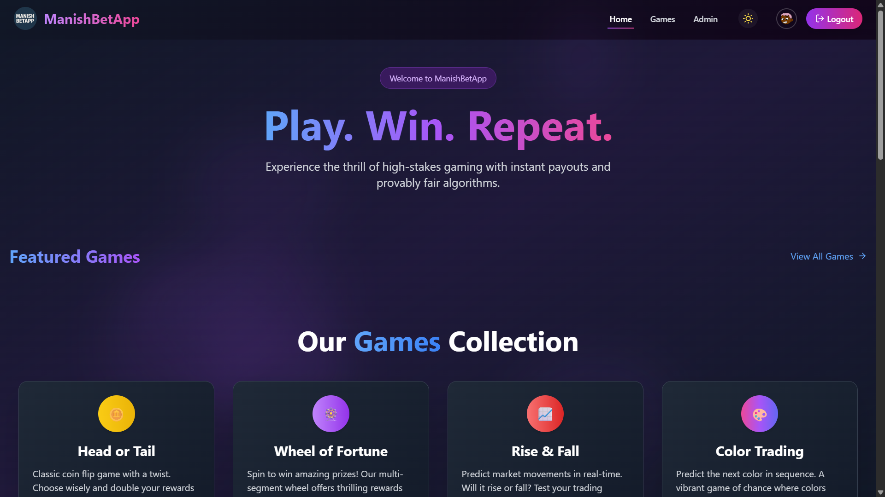
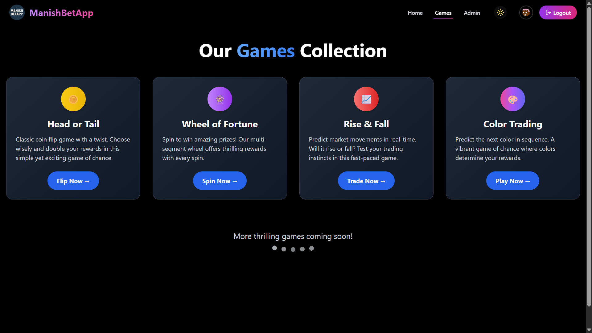
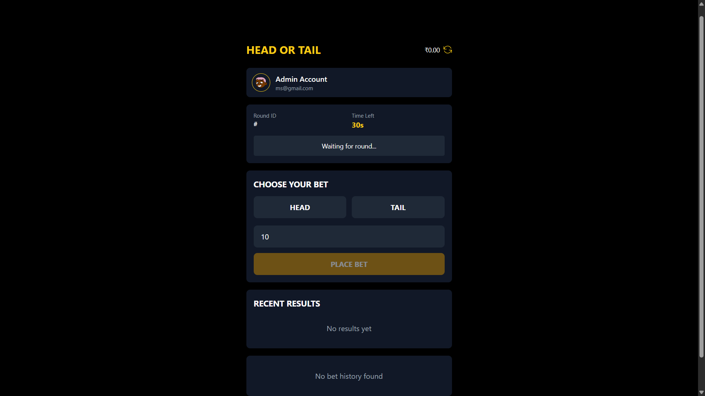
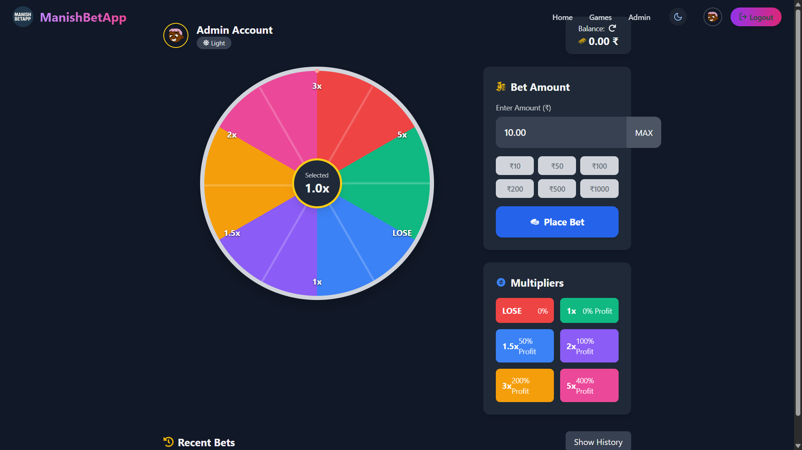
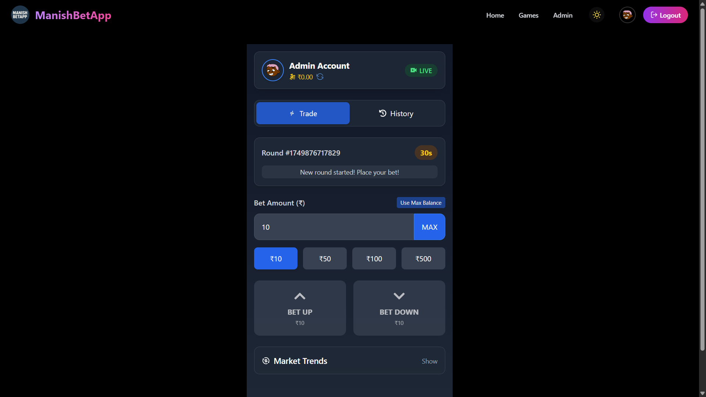
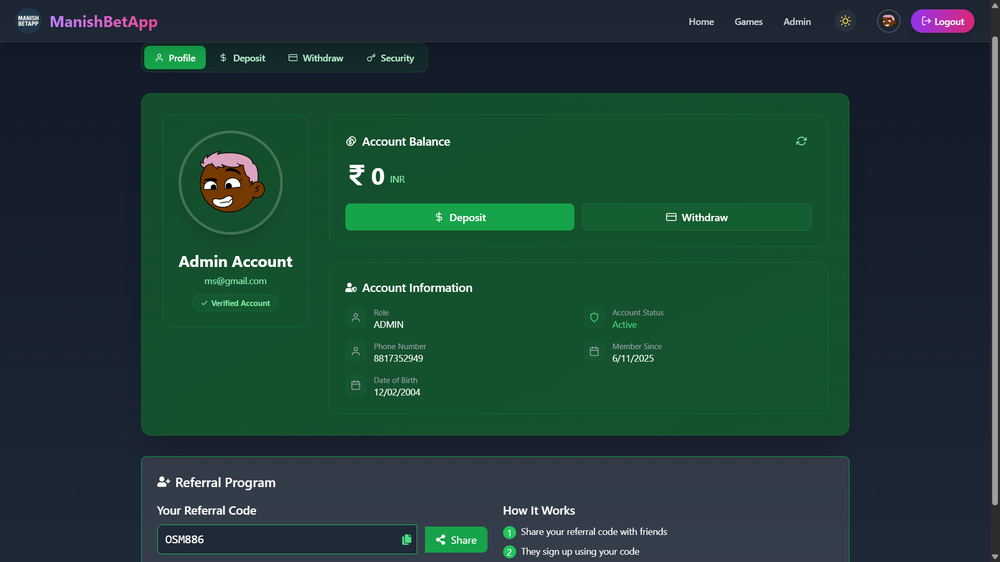
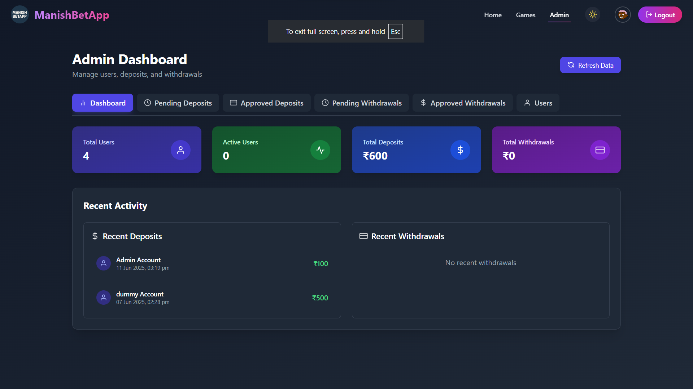
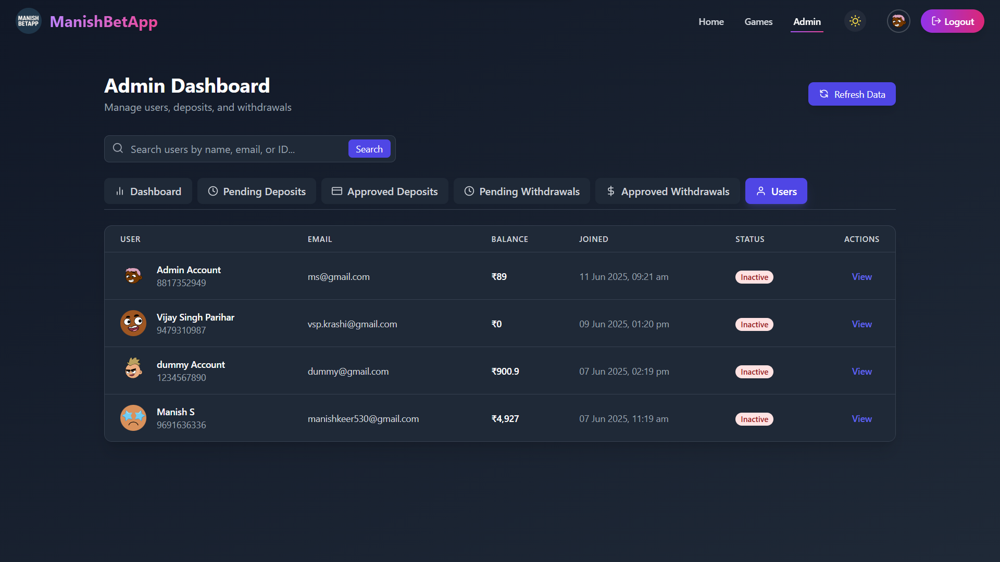

# ManishBetting App — A Real-Time Betting Platform 🎰

[](https://manish-bet-app.vercel.app)
[](LICENSE)
[](https://nodejs.org/)
[](https://reactjs.org/)
[](https://mongodb.com/)

## 🌐 Live Demo

**🔗 [Try ManishBetting App Live](https://manish-bet-app.vercel.app)**

Experience the thrill of real-time betting with our secure and responsive platform!

---

## 📖 Description

ManishBetting App is a **fully functional, real-time betting platform** that provides users with an immersive gaming experience. Users can create accounts, manage their digital wallets, earn referral bonuses, and participate in exciting 30-second live games through a secure and responsive web interface.

Built with modern web technologies, the platform ensures seamless real-time interactions using WebSocket connections, secure authentication, and a comprehensive admin panel for platform management.

---

## ✨ Key Features

### 🔐 **User Authentication System**
- Secure user registration and login
- Forgot password functionality with email recovery
- Change password with verification
- JWT-based session management

### 💰 **Advanced Wallet System**
- Real-time balance tracking
- Secure deposit and withdrawal functionality
- Transaction history with detailed records
- Instant balance updates across all sessions

### 🎁 **Referral Program**
- Unique referral codes for each user
- Automatic bonus calculation and distribution
- Multi-level referral tracking
- Real-time referral earnings dashboard

### 🎮 **Real-Time Gaming Engine**
All games run on **30-second cycles** with live WebSocket updates:

- **🪙 Head or Tail** — Classic coin flip with minority wins
- **🎡 Wheel of Fortune** — Spin for random multiplier payouts
- **📈 Rise & Fall** — Predict market movement trends
- **🎨 Color Trading** — Choose red, green, or violet with varying odds

### 📱 **Modern User Experience**
- Fully responsive design for all devices
- Fast loading times and smooth animations
- Intuitive user interface with Tailwind CSS
- Real-time notifications and updates

---

## 🛡️ Admin Panel Features

### 👥 **User Management**
- Complete user profile access and editing
- Wallet balance monitoring and adjustments
- Referral network visualization
- User activity tracking and analytics

### 💳 **Transaction Control**
- View all deposits and withdrawals in real-time
- Approve or reject pending transactions
- Generate financial reports and summaries
- Monitor suspicious activities and patterns

### 📈 **Platform Analytics**
- Real-time user activity monitoring
- Game performance metrics and statistics
- Revenue tracking and profit analysis
- System health and performance dashboards

### 🔐 **Security Features**
- Admin-only secure access with role-based permissions
- Audit logs for all administrative actions
- Two-factor authentication support
- IP whitelisting and access controls

---

## 🚀 Tech Stack

| Category | Technology |
|----------|------------|
| **🖥 Frontend** | React.js + TypeScript + Tailwind CSS |
| **⚛️ State Management** | Redux Toolkit |
| **🔐 Authentication** | JWT (JSON Web Token) |
| **🛠 Backend** | Node.js + Express.js |
| **🧮 Database** | MongoDB with Mongoose ODM |
| **🌐 Real-Time** | WebSocket (Socket.io) |
| **🖼 Media Storage** | Cloudinary |
| **📧 Email Service** | Nodemailer |
| **🔒 Security** | bcryptjs, helmet, cors |

---

## 📦 Installation

### Prerequisites
- Node.js (v18 or higher)
- MongoDB Atlas account or local MongoDB installation
- Cloudinary account for media storage

### 1. Clone the Repositories

```bash
# Clone frontend repository
git clone https://github.com/Manish-keer19/Betting_App_Frontend
cd manishbetting-frontend

# Clone backend repository (in a separate terminal)
git clone https://github.com/Manish-keer19/Betting_App_Backend
cd manishbetting-backend
```

### 2. Install Dependencies

```bash
# Frontend installation
npm install

# Backend installation (in backend directory)
npm install
```

### 3. Environment Setup

Create `.env` files in both frontend and backend directories with the required variables (see Environment Variables section).

### 4. Start the Servers

```bash
# Start backend server (PORT: 5000)
npm run dev

# Start frontend server (PORT: 3000)
npm start
```

---

## 🔧 Environment Variables

### Backend `.env`
```env
# Database
MONGO_URI=your_mongodb_connection_string

# Authentication
JWT_SECRET=your_jwt_secret_key
JWT_EXPIRES_IN=7d

# Cloudinary Configuration
CLOUDINARY_CLOUD_NAME=your_cloudinary_cloud_name
CLOUDINARY_API_KEY=your_cloudinary_api_key
CLOUDINARY_API_SECRET=your_cloudinary_api_secret

# Email Configuration
EMAIL_FROM=your_smtp_email
EMAIL_HOST=your_smtp_host
EMAIL_PORT=587
EMAIL_USER=your_smtp_username
EMAIL_PASS=your_smtp_password

# Server Configuration
PORT=5000
NODE_ENV=production

# Admin Configuration
ADMIN_SECRET_KEY=your_admin_secret
```

### Frontend `.env`
```env
REACT_APP_API_URL=http://localhost:5000/api
REACT_APP_SOCKET_URL=http://localhost:5000
REACT_APP_CLOUDINARY_UPLOAD_PRESET=your_upload_preset
```

---

## 🔗 Live Links

| Resource | Link |
|----------|------|
| 🌐 **Live Application** | [https://manish-bet-app.vercel.app/](https://manish-bet-app.vercel.app/) |
| 🛠 **Backend Repository** | [Backend Repo](https://github.com/Manish-keer19/Betting_App_Backend) |
| 📂 **Frontend Repository** | [Frontend Repo](https://github.com/Manish-keer19/Betting_App_Frontend) |

---
## 📸 Screenshots

---

### 🏠 Home Page
A modern, responsive home page showing live games and wallet summary.


---

## 🎮 Game Screens


 ### All Games
  

### 1️⃣ Head or Tail
Users choose either "Head" or "Tail". The team with fewer players wins.


---

### 🎡 Wheel of Fortune
Click the "Spin" button and let the wheel stop on a random color. Each color has a different payout multiplier.


---

### 📉 Rise & Fall
Users predict the market trend — "Rise" or "Fall". Inspired by trading dashboards with candlestick charts.


---

### 🔴🟢🟣 Color Trading
Users pick Red, Green, or Violet. Each color has unique probability and return rate.


---

## 👤 Profile Section
Users can view their wallet balance, transaction history, referral code, and personal details.


---

## 🧑‍💼 Admin Panel

### 📊 Admin Dashboard
Secure panel showing live stats on deposits, withdrawals, and active players.


---

### 👥 Users List
Admin can view full user data including wallet balance, referrals, and recent activity.


---

## 👨‍💻 Developer

**Developed by [Manish Keer](https://github.com/Manish-keer19)**

🚀 **MERN Stack Developer | Real-Time Application Specialist**

Passionate about creating scalable, secure, and user-friendly web applications with modern technologies. Specialized in real-time applications, betting platforms, and full-stack development.

### 🛠️ **Skills & Expertise**
- Full-Stack Web Development (MERN)
- Real-Time Applications with WebSocket
- Database Design & Optimization
- RESTful API Development
- Cloud Services Integration
- UI/UX Design Implementation

---

## 📄 License

This project is licensed under the **MIT License** - see the [LICENSE](LICENSE) file for details.

```
MIT License

Copyright (c) 2024 Manish Keer

Permission is hereby granted, free of charge, to any person obtaining a copy
of this software and associated documentation files (the "Software"), to deal
in the Software without restriction, including without limitation the rights
to use, copy, modify, merge, publish, distribute, sublicense, and/or sell
copies of the Software, and to permit persons to whom the Software is
furnished to do so, subject to the following conditions:

The above copyright notice and this permission notice shall be included in all
copies or substantial portions of the Software.
```

---

## 🤝 Feedback & Connect

I'm always open to **feedback, suggestions, and collaboration opportunities!**

### 📬 **Get in Touch**
- 💼 **LinkedIn**: Connect for professional networking
- 📧 **Email**: Reach out for project discussions
- 🐙 **GitHub**: Check out my other projects and contributions
- 💬 **Issues**: Report bugs or request features in the repository

### 🌟 **Show Your Support**
If you found this project helpful or interesting:
- ⭐ Star the repository
- 🍴 Fork and contribute
- 📢 Share with the community
- 💡 Suggest improvements

---

## 🔮 Future Enhancements

- 📱 Mobile application (React Native)
- 🤖 AI-powered game recommendations
- 🏆 Tournament and leaderboard system
- 💳 Cryptocurrency payment integration
- 🌍 Multi-language support
- 📊 Advanced analytics dashboard

---

**Made with ❤️ by Manish Keer | © 2024 ManishBetting App**